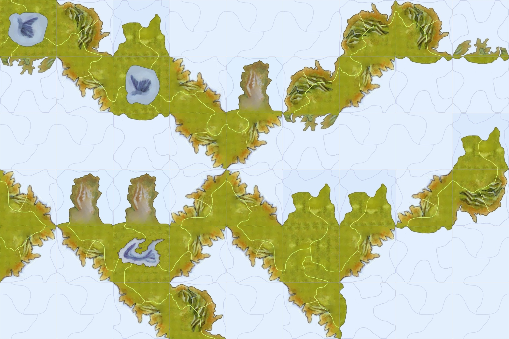

# civ_board_gen
Random map generation for Sid Meier's Civilization: The Board Game

# setup and build

Install required python packages... preferably in a virtual environment

```bash
$ python -m venv venv
$ source ./venv/bin/activate
$ pip install -r requirements
```

Then, run make!

```bash
$ make map
```

# example


